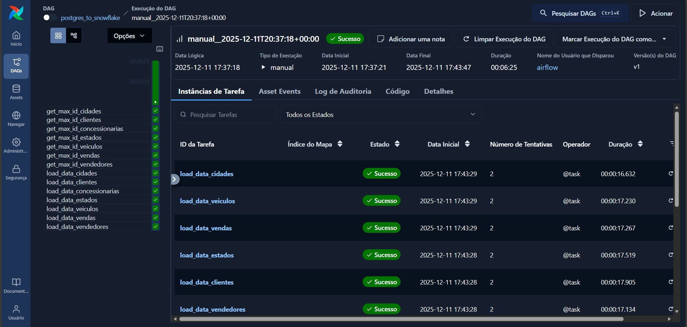
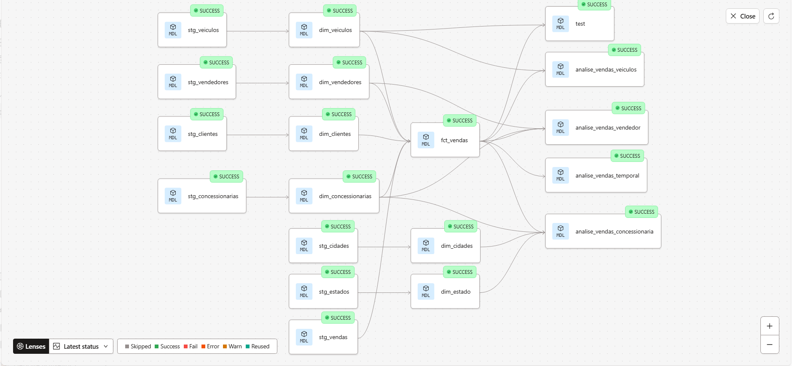
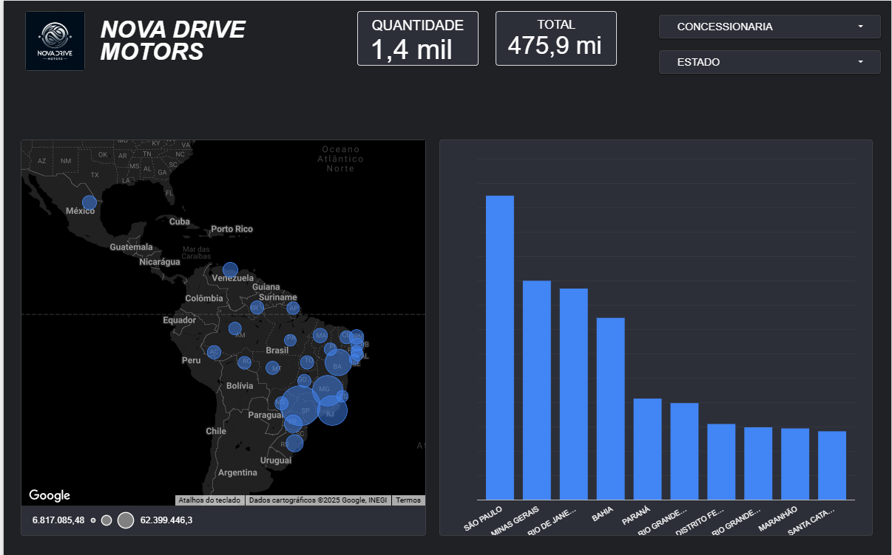

# 🚗 NovaDrive: Modern Data Stack ELT

> **Pipeline de Engenharia de Dados ponta a ponta: AWS, Airflow, Snowflake, dbt e Looker.**

Projeto prático simulando a modernização de dados de um e-commerce automotivo. O objetivo foi sair de um banco transacional isolado para um **Data Lakehouse** com governança e análise em tempo real.

---

## 🛠️ Tech Stack
* **Cloud & Infra:** AWS EC2 (T2.Micro), Linux Ubuntu, Docker.
* **Orquestração:** Apache Airflow (Python).
* **Data Warehouse:** Snowflake.
* **Engenharia de Analytics:** dbt Core & Cloud (Modelagem Star Schema).
* **Visualização:** Looker Studio.

---

## 🚀 Diferenciais de Engenharia (Desafios Reais)

Este projeto vai além do básico, implementando soluções para problemas reais de produção:

### 1. Robustez na Ingestão (Airflow)
* **Carga Incremental:** Pipeline otimizado para buscar apenas novos registros (CDC lógico via `MAX(ID)`).
* **Tratamento de Concorrência:** Solução de *Race Conditions* e duplicidade de dados utilizando travas de execução (`max_active_runs=1`) e limpeza via SQL (`QUALIFY`).

### 2. Infraestrutura e Segurança (AWS/Networking)
* Configuração manual de **Security Groups** na AWS e tunelamento para acesso seguro ao banco de dados.

### 3. Governança e Transformação (dbt)
* **Separação de Ambientes:** Implementação de arquitetura profissional separando o ambiente de desenvolvimento (schemas pessoais) do ambiente de produção (`ANALYTIC`).
* **Automação via dbt Cloud:** Configuração de Jobs agendados na nuvem para atualizar as regras de negócio e materializar as tabelas Fato e Dimensão automaticamente após a carga do Airflow.
* **Testes de Qualidade:** Aplicação de testes (`unique`, `not_null`) e testes de regras de negócio personalizadas (Singular Tests) para garantir que vendas fora do padrão sejam identificadas.

---

## 📸 Resultados

### Orquestração e Monitoramento
O Airflow gerenciando as dependências e executando o pipeline com sucesso.

### Linhagem de Dados (Data Lineage)
Visualização do dbt mostrando o fluxo de transformação: de dados brutos (Stage) para o modelo dimensional (Fatos e Dimensões).

### Visualização Final
Dashboard no Looker Studio consumindo a tabela `fct_vendas` processada.

---

### Autor
**Isadora**
[Linkedin: https://www.linkedin.com/in/isadorapbernards]